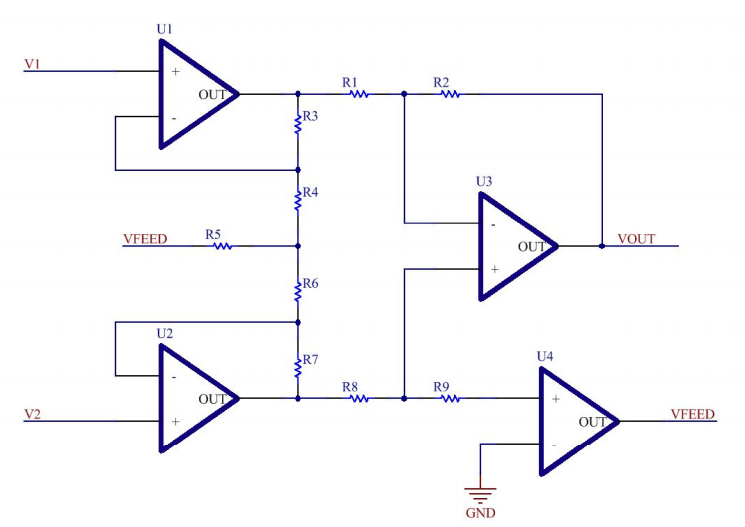

# Los amplificadores de instrumentación se les requieren las siguientes características:
* Son amplificadores diferenciales con una ganancia diferencial precisa y estable,
generalmente en el rango de 1 a 1000.
* Su ganancia diferencial se controlada mediante un único elemento analógicos
(potenciómetro resistivo) o digital (conmutadores) lo que facilita su ajuste.
* Su ganancia en modo común debe ser muy baja respecto de la ganancia diferencial,
esto es, debe ofrecer un CMRR muy alto en todo el rango de frecuencia en que opera.
* Una impedancia muy alta para que su ganancia no se vea afectada por la impedancia
de la fuente de entrada.
* Una impedancia de salida muy baja para que su ganancia no se vea afectada por la
carga que se conecta a su salida.
* Bajo nivel de las tensión de offset del amplificador y baja deriva en el tiempo y con la
temperatura, a fin de poder trabajar con señales de continua muy pequeñas.
* Una anchura de banda ajustada a la que se necesita en el diseño.
* Un factor de ruido muy próximo a la unidad, Esto es, que no incremente el ruido.
* Una razón de rechazo al rizado a la fuente de alimentación muy alto
* Los modelos de amplificador de instrumentación que abundan en internet usan 3 opamp en vez de 4. El 4° parece que contribuye a la estabilidad de tensión entre las entradas.
* Un opamp en consideracion es el **NM5534** por su figura de ruido cerca de la unidad y porque tiene muy baja impedancia de salida 
 **Edit**: No vamos a utilizar el **NM 5534** por su baja impedancia de entrada respecto a la del **TL084**. La de este ultimo es **7** ordenes de magnitud más grande. (COLOCAR EN EL INFORME)
